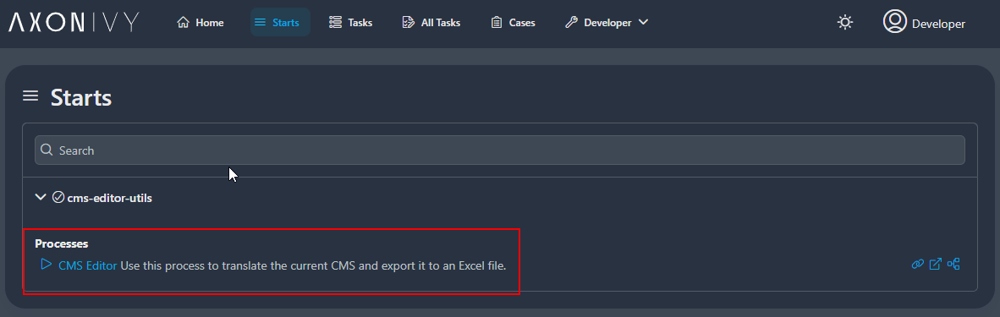
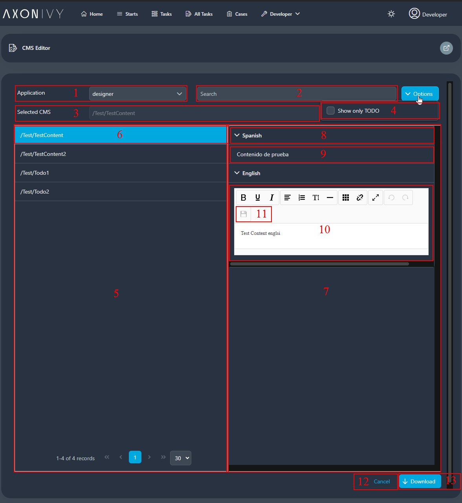

# CMS-Editor
In AxonIvy werden Sprachen für Benutzeroberflächen, Benachrichtigungen oder
E-Mails innerhalb des CMS verwaltet. Wir freuen uns, Ihnen den neuen CMS-Editor
vorstellen zu können, der die Sprachbearbeitung erheblich vereinfacht! Die
wichtigsten Funktionen sind:

- Benutzerfreundlicher Editor zum Übersetzen neuer Sprachen
- Bearbeiten Sie eine unbegrenzte Anzahl von Sprachen.
- Einfache Stile verfügbar
- In der Übersetzung sind keine HTML-Tags erforderlich.

** *In dieser Version werden CMS-Aktualisierungen in Echtzeit noch nicht
unterstützt. Benutzer müssen nach der Bearbeitung das geänderte Paket im
ZIP-Format herunterladen und es mit Axon Ivy Designer erneut in das Projekt
importieren. Die Änderungen werden erst wirksam, nachdem das neue Release-Paket
erstellt und in der Engine bereitgestellt wurde.* **

## Demo
### 1. Start des CMS-Editor-Prozesses:
- Benutzer sollten die Rolle „CMS_ADMIN” haben, um den Prozess zu starten.
  

### 2. Hauptseite des CMS-Editors:

1. Anwendungsauswahl: Jede Ivy-Engine kann mehrere Anwendungen enthalten. Wählen
   Sie zunächst die Anwendung aus, an der Sie arbeiten möchten.
2. Suchbegriff: Sie können Text eingeben, um nach URI und Inhalt zu suchen. Bei
   der Suche wird die Groß-/Kleinschreibung nicht berücksichtigt.
3. Ausgewähltes CMS: Zeigt den Schlüssel des ausgewählten Inhalts an.
4. Nur TODO filtern: Diese Option filtert alle Inhalte mit dem Präfix „TODO”.
5. Ergebnistabelle: Zeigt alle URIs an. Sie können zur nächsten Seite navigieren
   und die Seitengröße ändern.
6. Auswählen von Inhalten: Durch Klicken auf die URI werden die Inhalte in den
   Inhaltsbereich geladen.
7. Inhaltsbereich: Zeigt alle Sprachen im Vorschaumodus an.
8. Sprachname: Zeigt den Namen der Sprachen an.
9. Inhalt: Zeigt den Inhalt der Sprache (8) im Vorschaumodus an.
10. Editor: Zeigt den Inhalt im Bearbeitungsmodus an. Sie können den Inhalt mit
    dem WYSIWYG-Editor aktualisieren.
11. Speichern-Button: Der Editor speichert nicht automatisch. Klicken Sie auf
    den Speichern-Button, um den bearbeiteten Inhalt zu speichern.
12. Schaltfläche „Abbrechen“: Schließt die Editor-Seite.
13. Download-Button: Lädt eine ZIP-Datei mit allen übersetzten Inhalten
    herunter.

